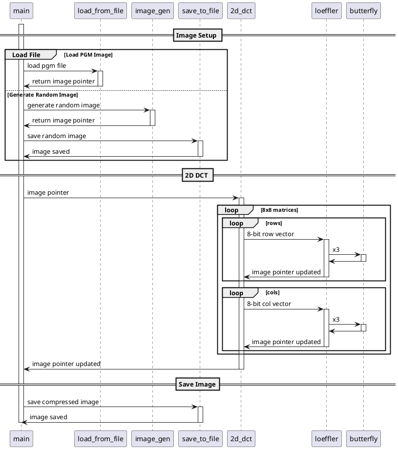

#2-D Discrete Cosine Transform Sequence Diagram

```plantuml
@startuml
== Image Setup ==
group Load File [Load PGM Image]
    activate main
    main -> load_from_file : load pgm file
    activate load_from_file
    load_from_file -> main : return image pointer
    deactivate load_from_file
    else Generate Random Image
    main -> image_gen : generate random image
    activate image_gen
    image_gen -> main: return image pointer
    deactivate image_gen
    main -> save_to_file : save random image
    activate save_to_file
    save_to_file -> main : image saved
    deactivate save_to_file
end

== 2D DCT ==
main -> 2d_dct : image pointer
activate 2d_dct
loop 8x8 matrices
    loop rows
        2d_dct -> loeffler : 8-bit row vector
        activate loeffler
        loeffler -> butterfly : x3
        activate butterfly
        butterfly -> loeffler
        deactivate butterfly
        loeffler -> 2d_dct : image pointer updated
        deactivate loeffler
    end
    loop cols
        2d_dct -> loeffler : 8-bit col vector
        activate loeffler
        loeffler -> butterfly : x3
        activate butterfly
        butterfly -> loeffler
        deactivate butterfly
        loeffler -> 2d_dct : image pointer updated
        deactivate loeffler
    end
end 
2d_dct-> main : image pointer updated
deactivate 2d_dct

== Save Image== 
main -> save_to_file : save compressed image
activate save_to_file
save_to_file-> main : image saved
deactivate save_to_file
deactivate main
@enduml
plantuml
```